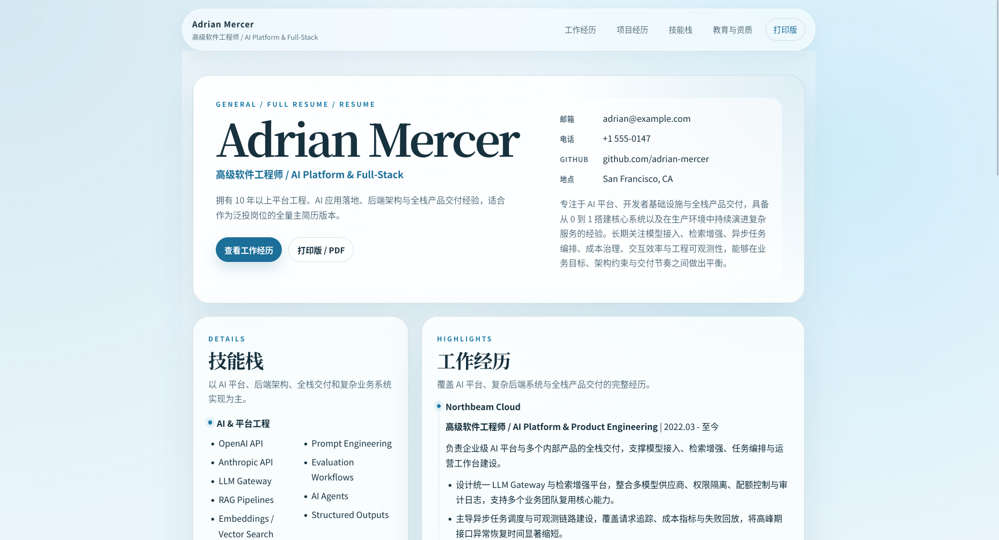

# Lie's ResumeFoundry




一个基于 Astro 与 Cloudflare Pages 构建的私有化简历站点模板，面向“多版本简历管理 + 多样式渲染 + 二维码受控访问”的使用场景。

项目的核心目标不是只生成一份静态简历，而是提供一套可以长期维护的简历发布方案：

- 使用 Markdown 驱动简历内容
- 支持同一仓库下维护多份简历版本
- 支持为不同简历选择不同渲染样式
- 支持通过二维码邀请链接控制访问入口
- 支持部署到 Cloudflare Pages，并使用 Pages Functions + D1 实现访问拦截与服务端 session

## 项目提供的功能

### 1. 多简历版本

一套仓库可以同时维护多份简历，例如：

- 全量主简历
- AI 平台版
- 全栈产品版
- 其他定向版本

每份简历位于独立目录：

```text
src/content/resumes/<resume-id>/
```

并通过 `_meta.md`、`00-profile.md` 和 section 文件共同驱动渲染。

### 2. 多样式渲染

项目当前已内置两套样式：

- `glass`
  蓝色玻璃风，强调卡片感、双栏布局与强视觉层级
- `editorial`
  社论排版风，强调单栏阅读、留白和内容节奏

每份简历可以在自己的 `_meta.md` 中声明 `styleId`，从而独立选择样式，而不需要复制内容。

### 3. Web / Print 双输出

每份简历默认同时拥有：

- 网页版：`/resume/<id>`
- 打印版：`/resume/<id>/print`

主简历同时映射到：

- `/`
- `/print`

因此，本项目同时适用于在线浏览与 PDF 导出场景。

### 4. 内容驱动维护

简历数量、名称、排序、是否展示、默认样式、主简历归属等核心元数据均来自内容目录自身，而不是额外的硬编码表。

这意味着：

- 新增简历时主要工作集中在内容目录
- 简历维护更接近“编辑内容”而不是“改代码”
- 更适合长期迭代和多人协作

### 5. 二维码受控访问

项目内置发码脚本，可直接生成：

- 邀请链接
- 对应二维码 SVG

并支持：

- `single_use`
- `reusable_until_expire`
- `limited_uses`

三种邀请码模式，以及不同的 session 生命周期策略。

### 6. Cloudflare 部署链路

项目已接入：

- Cloudflare Pages
- Pages Functions
- D1

用于实现：

- 访问拦截
- 邀请 token 校验
- 服务端 session 创建与吊销
- 会话失效后的重定向

## 项目优势

### 内容与展示解耦

简历内容与样式实现分离：

- 内容层负责“写什么”
- 样式层负责“怎么展示”

这使得同一份内容可以被不同样式复用，也使新增样式时不需要复制现有简历正文。

### 适合真实投递场景

项目不是单纯的静态简历页面，而是更贴近真实投递流程：

- 可以维护一份主简历和多份定制版
- 可以为不同岗位指定不同入口
- 可以控制访问链接的有效期与使用次数

### 部署形态清晰

项目当前部署模型明确且单一：

- Astro 负责构建静态页面
- Cloudflare Pages 托管站点
- Pages Functions 负责鉴权
- D1 保存邀请码与 session

没有额外引入不必要的后台服务，复杂度可控。

### 可扩展但不过度设计

项目已经支持：

- 新增简历
- 新增样式
- 新增区块
- 隐藏区块
- 调整默认简历

但仍然保持了较低的心智负担。日常编辑主要集中在 `src/content/resumes/` 目录中。

## 适用场景

本项目适合以下用途：

- 维护一份长期可演进的个人简历站
- 面向不同岗位维护多套简历版本
- 需要通过二维码或短期链接控制访问
- 希望将简历站部署到 Cloudflare Pages

本项目提供的鉴权与多版本能力。

## 快速开始

### 环境要求

- Node.js `>= 22.12.0`
- `npm`
- Cloudflare 账号
- Wrangler CLI 登录能力

### 1. 安装依赖

```sh
npm install
```

### 2. 仅预览前端页面

```sh
npm run dev
```

默认访问：

- `http://127.0.0.1:4321/`
- `http://127.0.0.1:4321/resumes`

此模式适合：

- 编辑简历内容
- 调整样式
- 检查页面布局

但不适合验证：

- Cloudflare Pages Functions
- D1
- 邀请码登录链路

### 3. 初始化本地 D1

如果需要完整验证鉴权链路，先初始化本地数据库：

```sh
npx wrangler d1 execute "lies-resumefoundry-auth" --local --file "database/schema.sql"
```

### 4. 构建项目

```sh
npm run build
```

### 5. 使用 Pages 本地运行时启动

```sh
npx wrangler pages dev "dist" --port 8788 --ip 127.0.0.1
```

此模式更接近真实部署环境，适合验证：

- 中间件拦截
- `/auth/qr`
- `/auth/logout`
- session cookie
- D1 访问

### 6. 生成本地测试邀请码

```sh
npm run issue-qr -- \
  --base-url "http://127.0.0.1:8788" \
  --local \
  --mode "single_use" \
  --ttl-minutes 10 \
  --next "/"
```

脚本会：

- 向本地 D1 写入一个 invite token
- 在 `generated-qr/` 下生成二维码 SVG
- 输出可直接访问的邀请链接

## 项目结构概览

```text
.
├── docs/                         # 文档
├── database/                     # D1 schema
├── functions/                    # Cloudflare Pages Functions
├── public/                       # 静态资源
├── scripts/                      # 创建简历、生成二维码等脚本
├── src/
│   ├── components/               # 通用组件与样式组件
│   ├── content/resumes/          # 简历内容目录
│   ├── lib/                      # 内容装配、样式目录、鉴权基础库
│   ├── pages/                    # 页面路由
│   └── styles/                   # 通用样式与主题样式
├── package.json
└── wrangler.jsonc
```

### 关键目录说明

- `src/content/resumes/`
  所有简历内容的单一事实来源
- `src/components/resume-styles/`
  各个样式的 Web / Print 渲染实现
- `functions/`
  Cloudflare Pages Functions 鉴权入口
- `scripts/`
  日常维护脚本
- `database/schema.sql`
  D1 表结构

## 文档导航

以下文档提供了面向仓库用户的详细说明：

- [创建与编辑简历](./docs/create-and-edit-a-resume.md)
- [创建新的样式](./docs/create-a-new-style.md)
- [使用脚本生成二维码与邀请链接](./docs/generate-qr-codes-and-links.md)
- [部署到 Cloudflare](./docs/deploy-to-cloudflare.md)

建议的阅读顺序：

1. 先阅读本文，理解项目定位与结构
2. 再阅读“创建与编辑简历”
3. 若需要扩展视觉层，再阅读“创建新的样式”
4. 若要进入上线阶段，再阅读“生成二维码”与“部署到 Cloudflare”

## 常用命令

```sh
# 安装依赖
npm install

# 前端开发
npm run dev

# 构建
npm run build

# 创建一份新简历
npm run create-resume -- --id "staff-backend"

# 生成邀请二维码
npm run issue-qr -- --base-url "https://resume.example.com"
```

## 依赖项目与基础组件

本项目建立在以下核心依赖之上：

- [Astro](https://astro.build/)
  负责内容站点构建与页面路由
- [Cloudflare Pages](https://pages.cloudflare.com/)
  负责托管构建产物与运行 Pages Functions
- [Cloudflare Pages Functions](https://developers.cloudflare.com/pages/functions/)
  负责页面访问拦截、登录流转和退出登录
- [Cloudflare D1](https://developers.cloudflare.com/d1/)
  负责保存邀请码与 session
- [Wrangler](https://developers.cloudflare.com/workers/wrangler/)
  负责本地调试、D1 操作与部署
- [QRCode](https://www.npmjs.com/package/qrcode)
  负责生成二维码 SVG
- [TypeScript](https://www.typescriptlang.org/)
  负责类型检查与内容 schema 约束

对应的主要仓库依赖定义可在 [package.json](./package.json) 中查看。

## 当前路由形态

项目当前默认提供以下主要路由：

- `/`
  主简历网页版
- `/print`
  主简历打印版
- `/resumes`
  简历目录页
- `/resume/<id>`
  某份简历的网页版
- `/resume/<id>/print`
  某份简历的打印版
- `/unlock`
  邀请验证入口

## 维护建议

日常维护时，优先修改以下内容：

- `src/content/resumes/<resume-id>/_meta.md`
- `src/content/resumes/<resume-id>/00-profile.md`
- `src/content/resumes/<resume-id>/*.md`

只有在以下场景中，才需要改动代码层：

- 新增一种样式
- 调整样式组件的布局策略
- 修改鉴权逻辑
- 修改二维码生成逻辑
- 扩展部署与运行方式

## 许可证

本项目采用 `Apache License 2.0`。

- 完整许可证文本见 [LICENSE](./LICENSE)
- 官方许可证来源：<https://www.apache.org/licenses/LICENSE-2.0.txt>
